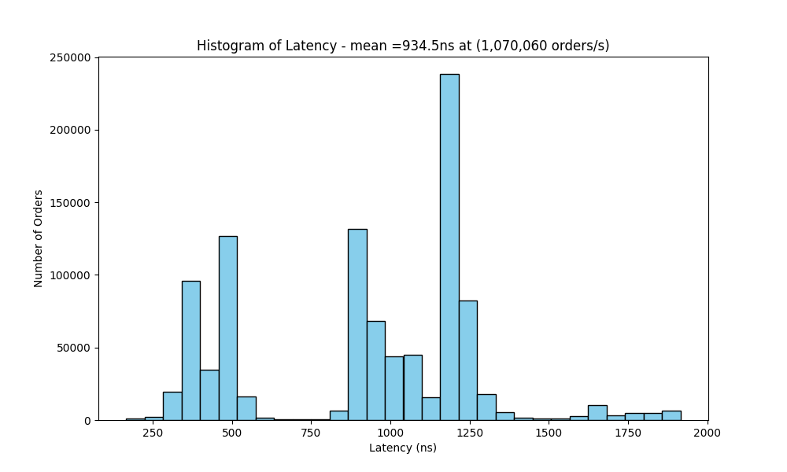

# Low Latency Limit Order Book

This is a Limit Order Book developed in `C++` from scratch, and can handle over 1 million TPS.

### Overview

Matching engines are core component of trading systems, most notably stock exchanges. This system was built to learn more about this field and the technical details
needed to facilitate these financial systems.

### Project Tree

```
├── CMakeLists.txt
├── LimitOrderBook
│   └── RedBlackTree
│       ├── RedBlackTree.hpp
│       └── RedBlackTreeNode.hpp
│   ├── Book.cpp
│   ├── Book.hpp
│   ├── Limit.cpp
│   ├── Limit.hpp
│   ├── Order.cpp
│   ├── Order.hpp
├── PerformanceTestingUtil
│   ├── Limit.cpp
│   ├── OrderExecutor.cpp
│   ├── OrderExecutor.hpp
│   ├── OrderGenerator.cpp
│   └── OrderGenerator.hpp
├── tests
│   ├── test_book.cpp
│   └── test_redblacktree.cpp
├── Makefile
├── README.md
├── book_test
├── limit_order_book
├── main.cpp
├── redblacktree_test
```

### Idea

This project references concepts mentioned in ([here](https://web.archive.org/web/20110219163448/http://howtohft.wordpress.com/2011/02/15/how-to-build-a-fast-limit-order-book/)). It states:

> The idea is to have a binary tree of Limit objects sorted by limitPrice, each of which is itself a doubly linked list of Order objects. Each side of the book, the buy Limits and the sell Limits, should be in separate trees so that the inside of the book corresponds to the end and beginning of the buy Limit tree and sell Limit tree, respectively. Each order is also an entry in a map keyed off idNumber, and each Limit is also an entry in a map keyed off limitPrice.

With this id mind, we can define a general structure:

```cpp
     Order  // single order (node in linked list)
      int idNumber;
      bool buyOrSell;
      int shares;
      int limit;
      int entryTime;
      int eventTime;
      Order *nextOrder;
      Order *prevOrder;
      Limit *parentLimit;

    Limit  // single limit price (node in tree)
      int limitPrice;
      int size;
      int totalVolume;
      Limit *parent;
      Limit *leftChild;
      Limit *rightChild;
      Order *headOrder;
      Order *tailOrder;

    Book
      Limit *buyTree;
      Limit *sellTree;
      Limit *lowestSell;
      Limit *highestBuy;
```

With this structure, we want to maintain:

```
Add – O(log M) for the first order at a limit, O(1) for all others
Cancel – O(1)
Execute – O(1)
GetVolumeAtLimit – O(1)
GetBestBid/Offer – O(1)
```

To handle the high frequency of orders efficiently, a self-balancing binary tree is essential to ensure operations remain fast. In school, we learned about AVL Trees, which maintain strict balance by ensuring the height difference between child subtrees is no greater than 1. However, in the blog, the author noted:

> The majority of activity in a limit order book consists of add and cancel operations as market makers compete for position, with executions being far less frequent.

Based on this insight, I decided to experiment with a Red-Black Tree instead. Unlike AVL Trees, Red-Black Trees enforce balance more leniently, which theoretically results in fewer rotations during rebalancing, making them potentially better suited for this use case.

### Performance on a 16GB M1 Pro Processor

The primary 5 tested operations were:

- `AddMarketOrder` - Places a market order that executes immediately at the best available price, consuming liquidity from the order book.\
- `AddLimitOrder` - Adds a limit order to the order book at a specified price (may execute immediately if it crosses the spread)
- `CancalLimitOrder` - Cancels an existing limit order in the order book, removing it from the market
- `AddLimitInMarket` - Places a marketable limit order, meaning the price is adjusted to be within or very close to the current bid-ask spread
- `ModifyLimitOrder` - Modifies an existing limit order in the order book (e.g., updating the quantity or price, **but not order type**)



### Next

- Test performance on compute cluster
- Add more order types e.g stop orders
- Plot performance vs. # of red black tree balances

### References

- https://www.quantstart.com/articles/high-frequency-trading-ii-limit-order-book/
- https://web.archive.org/web/20110219163448/http://howtohft.wordpress.com/2011/02/15/how-to-build-a-fast-limit-order-book/
- https://github.com/brprojects/Limit-Order-Book?tab=readme-ov-file (Data generator referenced from here)
